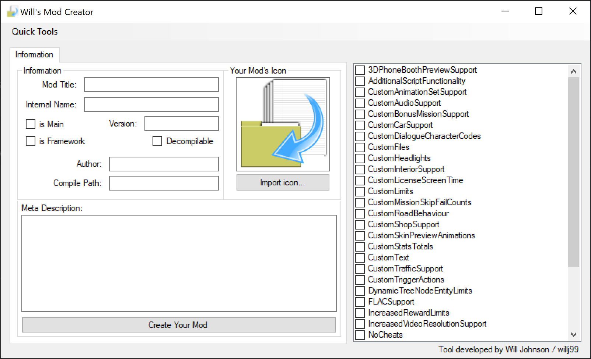

# Criteria
Using **Will's Mod Creator** is straightforward, but these criterion must be met to successfully package your mod:
- You must give your mod a title, exporting is not possible without doing so.
- You must require at the minimum, both CustomFiles and CustomText hacks via the Checked List Box.
- *Imported icons must be within a power of 2 in both height and width ranging up to 256x256. 
- *For story based mods with unique save games and statistics, enable the **is Main?** checkbox.
- *For frameworks (core), enable the **is Framework?** checkbox.

        *An asterisk denotes optional criteria

# Short Tutorial
## Meta Information
Setting up your first mod is easy. We can start by giving it a name, for example: 

       Futurama Hit And Run 
                    
**Note: / \ : * ? " < > | are not supported characters in Windows**

We then need to give our mod an internal name. For example:

       FHARv1

You can then enter your own description for your modification. Linebreaks in the description box are replaced with \n blocks in the meta.ini upon compilation. An example being this:

       " Welcome to Futurama Hit & Run, play as Bender, Leela and Fry
       and defend New New York from the evil mom corporation! "

Turned into this:
       
       " Welcome to Futurama Hit & Run, play as Bender, Leela and Fry\nand defend New New York from the evil mom corporation! "

## Hacks
Lastly, you can enable any hacks you are going to make use of, the majority of them come with pre-assembled templates which give you an understanding of how they work.

**Notes**
- 3DPhoneBoothPreviews will generate a commented template, make sure you read up on the documentation before uncommenting it.
- Some of the templates have commented code, edit them how you'd like. 
(For further information on hacks, go to https://donutteam.com and visit their documentation (thanks guys!))

## Exporting
Once your mod is all ready for packaging, hit the create mod button below the description box, you'll be prompted to export to a location of your choice. 

Your mod will be assembled in a folder which correlates to your mod's name. If your mod is in the **mods** folder used by ****Lucas' Simpsons Hit & Run Mod Launcher****, it will display in the mods list when you open that program, fully assembled. 

# Log
**V.1.0**
- First release, v.1.0
- Fully functional mod packager.
- Recoded from scratch and improved in C#

**V.0.1-V.0.9**
- Never released, began in 2017, stopped in mid 2018.
- Buggy, programmed in VB.NET till v.0.9.
- Lacked all 30+ hacks, very barebones.

