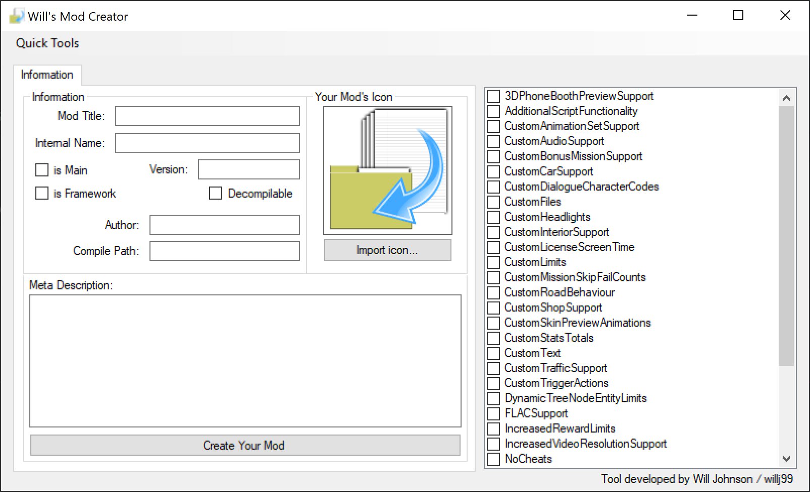

<body style="max-width: 700px; text-align: left; margin: 0 auto;">

# Criteria
Using **Will's Mod Creator** is fairly straightforward, but these criterion must be met to successfully package your mod:

- You must give your mod a title, exporting is not possible without doing so.
- You must require at the minimum, both CustomFiles and CustomText hacks via the Checked List Box.
- *For story based mods with unique save games and statistics, enable the **is Mod?** checkbox.
- *For frameworks (core), enable the **is Framework?** checkbox.

        *An asterisk denotes optional criteria

# Short Tutorial
Setting up your first mod is easy, specify a name, an internal name, a description, and any other criteria you see fit. Enable any hacks you are going to make use of, majority of them come with pre-assembled templates which give you an understanding of how they work.

Once your mod is all ready for packaging, hit the create mod button below the description box, you'll be prompted to export to a location of your choice. Your mod will be assembled in a folder which correlates to your mod's name. 

**Notes**
- 3DPhoneBoothPreviews will generate a commented template, make sure you read up on the documentation before uncommenting it.
- Some of the templates have commented code, edit them how you'd like. 

 (For further information on hacks, go to https://donutteam.com and visit their documentation (thanks guys!))

# Log
**V.1.0**
- First release, v.1.0
- Fully functional mod packager.
- Recoded from scratch and improved in C#

**V.0.1-V.0.9**
- Never released, began in 2017, stopped in mid 2018.
- Buggy, programmed in VB.NET till v.0.9.
- Lacked all 30+ hacks, very barebones.

